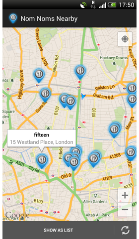

NomNom
===============

NomNom is a small app using the Google Places API to show nearby restaurants.

 

Developed By
------------

* The initial version was written by <a href="https://plus.google.com/117518039262793648233?rel=author">Friederike Wild</a> - <friederike.wild@devmob.de>

* Featured Art
  * Map pin base: "google map markers psd" by [PixelsDaily](http://pixelsdaily.com/)
  * Food icon from "200 Foodie Pack" by [Freepik](http://www.freepik.com/)
  

License
-------

    Copyright 2013 Friederike Wild

    Licensed under the Apache License, Version 2.0 (the "License");
    you may not use this file except in compliance with the License.
    You may obtain a copy of the License at

       http://www.apache.org/licenses/LICENSE-2.0

    Unless required by applicable law or agreed to in writing, software
    distributed under the License is distributed on an "AS IS" BASIS,
    WITHOUT WARRANTIES OR CONDITIONS OF ANY KIND, either express or implied.
    See the License for the specific language governing permissions and
    limitations under the License.
